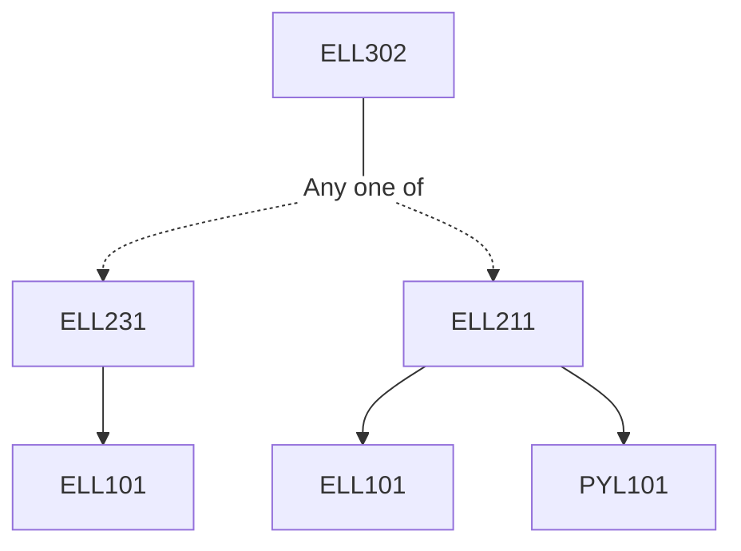

**Credits:** 3 (3-0-0)

**Prerequisites:** [[/Electrical Engineering/ELL231 | ELL231]] (EE3) / [[/Electrical Engineering/ELL211 | ELL211]] (EE1)

#### Description 
Introduction to Power Electronics devices and protection: Thyristor family devices, principle of operation, IGBT operation, principles and ratings. Snubber designs, selection and protection, Firing circuits. AC-DC converters: uncontrolled, semi-controlled, fully controlled and dual converters in single-phase and three-phase configurations, design, phase control, harmonic analysis, firing circuits and their designs. Improved power quality AC-DC converters.

Choppers: Introduction to dc-dc conversion, various topologies, buck, boost, buck-boost converters, High frequency isolated dc-dc converters: design problems, PWM control and operation.

Inverters: Basics of dc to ac conversion, inverter circuit configurations and principle of operation, VSI and CSI, single and three-phase configurations, Square wave and sinusoidal PWM control methods and harmonic control. Design problems.

AC voltage controllers: Introduction to ac to ac conversion, single- phase and three-phase ac voltage controller circuit configurations, applications, advantages, harmonic analysis, control, design problems. Cyclo-converters: single-phase to single-phase, three-phase to single-

phase, three-phase to three-phase and single-phase to three-phase circuit configurations thyristors and triacs.

### Prerequisite Tree

