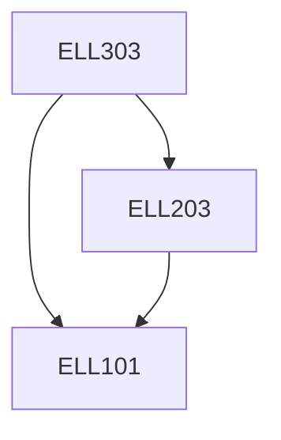

**Credits:** 4 (3-1-0)

**Prerequisites:** [[/Electrical Engineering/ELL101|ELL101]], [[/Electrical Engineering/ELL203|ELL203]]

#### Description
Introduction to the basic structure of power system along with various power generation technologies. Modeling of generators, transformers and transmission line for power system analysis. per unit system. Power flow analysis. Fault analysis in power systems. Power system stability studies. Transients in power system and travelling waves. Introduction to power system relaying and brief idea of over current, differentia and impedance based protection. Basic concepts of Power system operation and control. Introduction to HVDC and FACTS.

### Prerequisite Tree

