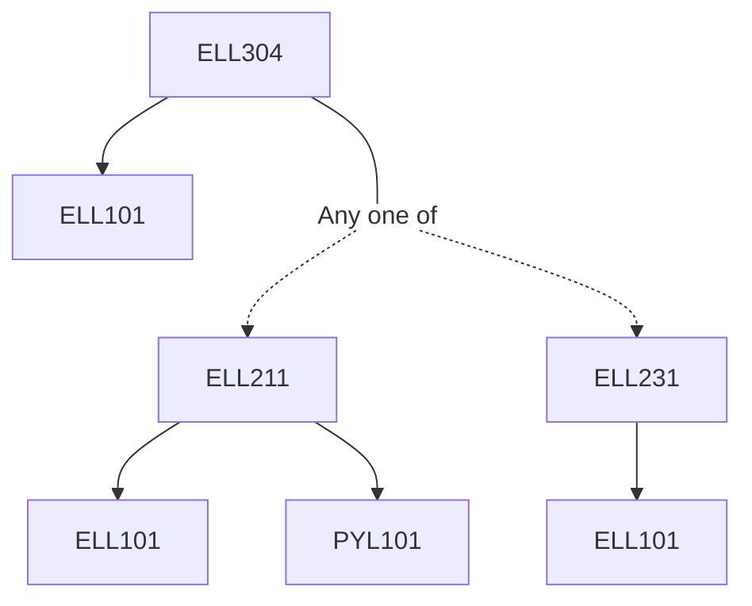

**Credits:** 5.5 (3-1-3)

**Prerequisites:** [[/Electrical Engineering/ELL101|ELL101]] and [[/Electrical Engineering/ELL202|ELL202]] and ([[/Electrical Engineering/ELL211|ELL211]] or [[/Electrical Engineering/ELL231|ELL231]])

#### Description
Review of working of BJT and MOSFET, large signal and small signal models, biasing schemes, analysis and design of various single stage amplifier configuration, low and high frequency analysis of single stage amplifiers, frequency compensation, current mirrors, multistage amplifiers; differential and operational amplifiers, negative and positive feedback, oscillators and power amplifiers.

### Prerequisite Tree

