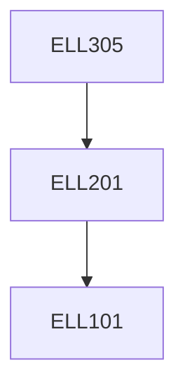

**Credits:** 3 (3-0-0)

**Prerequisites:** [[/Electrical Engineering/ELL201|ELL201]]

**Overlaps with:** CSL211

#### Description
Introduction: Performance measurement, Instruction Set Architecture, Computer Arithmetic, Processor: ALU design, Control design, Pipelining, Memory Hierarchy, I/O management, Multicores, Multiprocessors, Clusters, GPU.

### Prerequisite Tree

