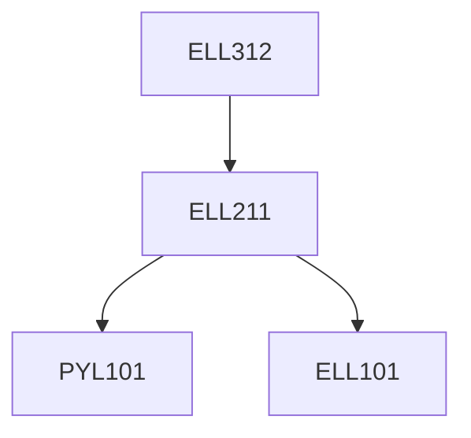

**Credits:** 3 (3-0-0)

**Prerequisites:** [[/Electrical Engineering/ELL211|ELL211]]

#### Description
Semiconductor materials (inorganic and organic), history of semiconductor IC devices, crystal structure, defects, vacancies and interstitials, semiconductor crystal growth, bulk doping methods, purification methods, wafer manufacture, diffusion, surface doping, oxidation, dopant redistribution, ion implantation and annealing, rapid thermal processes, photolithography, masks, photoresists, exposure, e-beam lithography, vacuum systems, gas flow, plasma processes, pumping theory, leaks, vacuum gauges, wet etching, plasma etching, process gas chemistry and polymerization, ion milling, reactive ion etching, lift-off, vapor pressure of materials, evaporation, sputtering, deposition rate and step coverage, codepositions, film growth mechanisms and stress, chemical vapor deposition, metal-organic chemical vapor deposition, atomic layer deposition, molecular beam epitaxy, planarization processes, interconnects, yield and device integration.

### Prerequisite Tree

