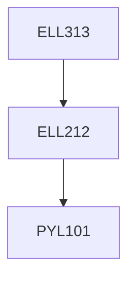

**Credits:** 3 (3-0-0) Prerequisites: ELL212

**Prerequisites:** [[/Electrical Engineering/ELL212|ELL212]]

#### Description
Starting from the principle of radiation different types of antenna;

wire, slot, planar and their arrays with feeds. Antenna synthesis and design and measurements. Characteristics of propagation of radio waves in different atmospheric layers and study of the losses, fading and scattering of microwave and millimeter waves in the atmosphere.

### Prerequisite Tree

