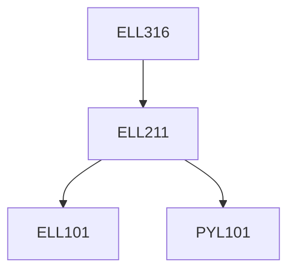

**Credits:** 3 (3-0-0)

**Prerequisites:** [[/Electrical Engineering/ELL211|ELL211]]

#### Description
Basic MOS characteristics; Deep sub-micron; velocity saturation; Dynamic MOS characteristics; parasitics; leakage; sizing; propagation delay; Logical effort, path delay, optimization; Ratio-ed logic, Pass transistor logic and parasitics; Dynamic logic, pulsed sequential logic; Logical synthesis, physical design, layout; Introduction to design of VLSI memories.

### Prerequisite Tree

