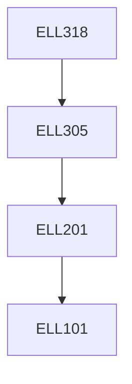

**Credits:** 3 (3-0-0)

**Prerequisites:** [[/Electrical Engineering/ELL305 | ELL305]]

**Overlaps with:** CSL316

#### Description 
Technology basics and digital logic families such as static CMOS, pass transistor, transmission gate, dynamic and domino logic. Advanced sequential logic elements with latch-based design and timing and clocking concepts. Design flows and paradigms. Data path, control and advanced pipeline implementations. Advanced digital arithmetic. Performance evaluation.

### Prerequisite Tree

