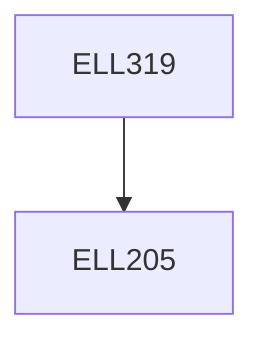

**Credits:** 4 (3-0-2)

**Prerequisites:** [[/Electrical Engineering/ELL205|ELL205]]

**Overlaps with:** ELL720

#### Description
Review of Signals and Systems, Sampling and data reconstruction processes. Z transforms. Discrete linear systems. Frequency domain design of digital filters. Quantization effects in digital filters. Discrete Fourier transform and FFT algorithms. High speed convolution and its application to digital filtering.

### Prerequisite Tree

