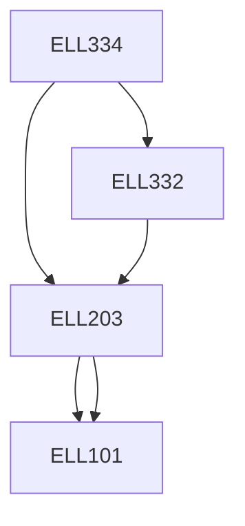

**Credits:** 4 (3-0-2)

**Prerequisites:** [[/Electrical Engineering/ELL203 | ELL203]], [[/Electrical Engineering/ELL332 | ELL332]]

#### Description 
Introduction and Application of DSP in the power electronic converter controlled drives, Types of processors used for power control and their comparison, computational advantages, Limitations. Introduction to peripherals ADC, DAC, PWM, Encoders and their interface. Interfacing issues, Sampling process, Harmonic analysis in real-time using a DSP, Assembly language programming of a DSP, Motor control applications. Pulse-Width Modulation and Pulse-Frequency Modulation schemes, lookup tables and real-time computation. Interfacing and signal conditioning circuits for DSP based schemes. Realization of computationally intensive algorithms like variable structure, adaptive and neural network schemes for Drives systems.

### Prerequisite Tree

