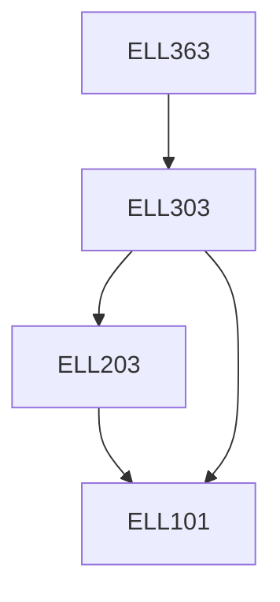

**Credits:** 3 (3-0-0)

**Prerequisites:** [[/Electrical Engineering/ELL303|ELL303]]

#### Description
Advanced concepts in power flow analysis, security analysis and state estimation. Economic load dispatch and unit commitment problem.

Voltage and frequency control in power systems. Advanced concepts in multi-machine dynamics and stability. Electrical transients in power systems. Wind and solar generation technologies and their integration into the grid. Issues in restructured power systems. Modern numerical protection.

### Prerequisite Tree

