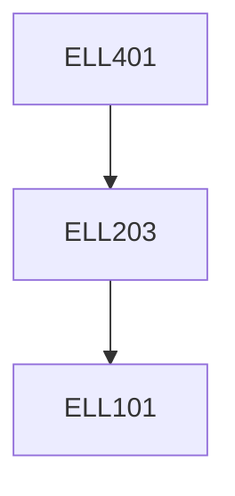

**Credits:** 3 (3-0-0)

**Prerequisites:** [[/Electrical Engineering/ELL203 | ELL203]]

#### Description 
Introduction to Advancement in Electromechanics, Permanent Magnet Brushless DC Machines, Permanent Magnet Synchronous Motors, Switched Reluctance Motors, Single-Phase Machines, Axial Field Machines and other Advanced Electrical Machines, Introduction to Control of Advanced Electrical Machines, Applications in Industry, Domestic Appliances, Electric Mobility, etc., Computer Aided Simulation and Design of Advanced Electrical Machines, Case Studies.

### Prerequisite Tree

