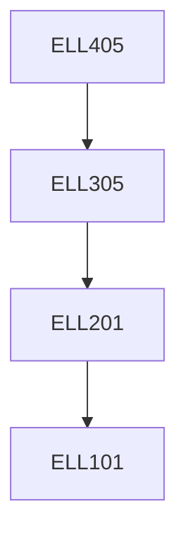

**Credits:** 3 (3-0-0)

**Prerequisites:** [[/Electrical Engineering/ELL305|ELL305]]

**Overlaps with:** COL331, MTL458, ELL783

#### Description
Introduction to OS; Process and Thread management; Scheduling; Concurrent threads and processes: mutual exclusion, synchronization, inter-process communication; Memory management: Cache and Virtual Memory management; Resource management: deadlock and its prevention; File management; I/O management; Introduction to real time systems; Elements distributed operating systems.

### Prerequisite Tree

