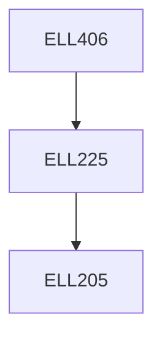

**Credits:** 3 (3-0-0)

**Prerequisites:** [[/Electrical Engineering/ELL225|ELL225]]

#### Description
Introduction to robotics. Basic components of robotic systems. Coordinate Transformation, D-H parameters. Forward and inverse kinematics. Velocity kinematics and Jacobian, Singularity analysis, Robot Dynamics : Holonomic and Non-Holonomic Systems. Trajectory planning. Robot control: linear and nonlinear. Actuators and Sensors. Vision based Robotic Control. Mobile Robots : Modeling and Control.

### Prerequisite Tree

