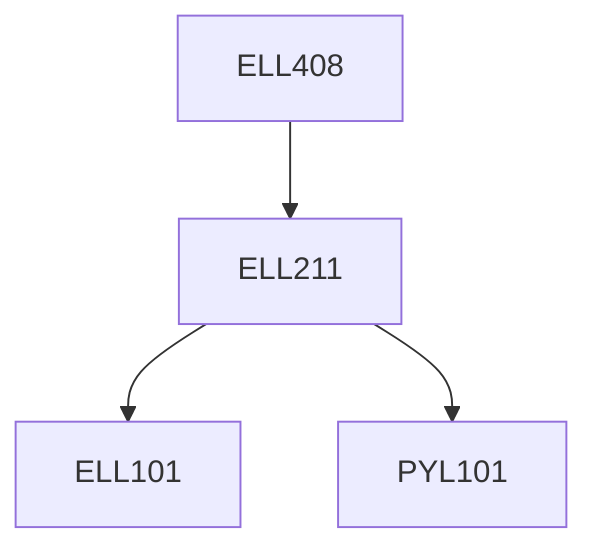

**Credits:** 3 (3-0-0)

**Prerequisites:** [[/Electrical Engineering/ELL211|ELL211]]

#### Description
MOS Transistors, MOS Inverters, Static CMOS Circuits, MOS Dynamic Circuits, Pass Transistor Logic Circuits, MOS Memories, Finite State Machines, Switching Power Dissipation, Dynamic Power Dissipation, Leakage Power Dissipation, Supply Voltage Scaling, Minimizing Switched Capacitance Minimizing Leakage Power, Variation Tolerant Design, Battery-Driven System Design.

### Prerequisite Tree

