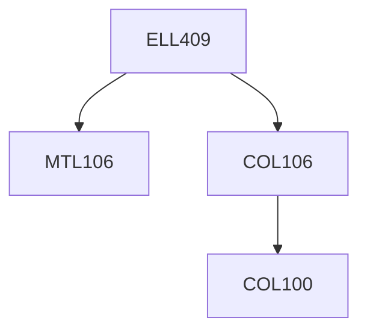

**Credits:** 4 (3-0-2)

**Prerequisites:** [[/Mathematics/MTL106|MTL106]], [[/Computer Science and Engineering/COL106|COL106]]

**Overlaps with:** ELL784, ELL789, COL341/COL774

#### Description
Introduction to machine intelligence and intelligent agents; problem solving; knowledge representation and reasoning (logical and probabilistic); need for learning; basics of machine learning; Decision Trees; Rule-based models; linear learning models; Support Vector Machines; Artificial Neural Networks; Deep Learning; Probabilistic Modelling; Naive Bayes; Reinforcement Learning; Clustering; Feature Selection; Principal Component Analysis; Combining models; Philosophical issues in intelligence and learning. Substantive implementation assignments or a term project involving design of an intelligent learning-based system.

### Prerequisite Tree

