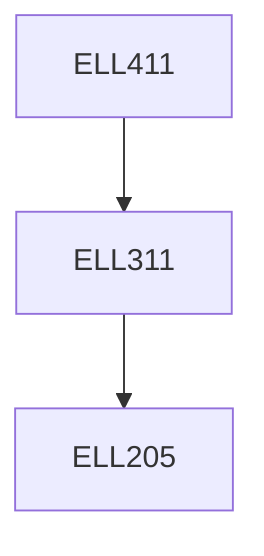

**Credits:** 4 (3-0-2)

**Prerequisites:** [[/Electrical Engineering/ELL311|ELL311]]

**Overlaps with:** ELL712

#### Description
Matched Filter, Error Rate due to Noise. Intersymbol Interference, Nyquist’s Criterion, Duobinary Signaling. Optimum Linear Receiver, Geometric Representation of Signals. Coherent Detection of Signals in Noise, Probability of Error. Coherent Digital Modulation Schemes: MPSK, MFSK, MQAM; Error Analysis. Noncoherent FSK, Differential PSK. Comparison of Digital Modulation Schemes, Bandwidth Efficiency. Pseudo-Noise Sequences and Spread Spectrum, Trellis coded modulation, Digital signaling over fading multipath channels, OFDM communications systems.

### Prerequisite Tree

