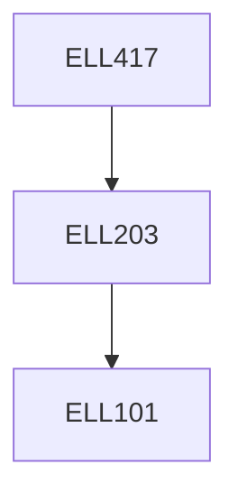

**Credits:** 3 (3-0-0)

**Prerequisites:** [[/Electrical Engineering/ELL203|ELL203]]

#### Description
Modeling of wind resource, aerodynamic characteristics, wind energy generators – steady-state and dynamic modeling, electrical and pitch controller design, effect of induction generators on grid operation, solar Photovoltaic systems – steady state and dynamic modeling, MPPT operation, power electronic systems for solar PV, fuel cells.

### Prerequisite Tree

