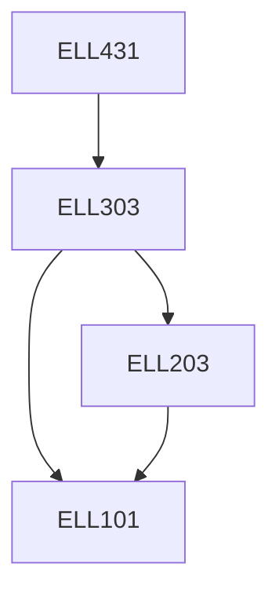

**Credits:** 3 (3-0-0)

**Prerequisites:** [[/Electrical Engineering/ELL303|ELL303]]

#### Description
Characteristic of Generation units, Economic dispatch of thermal plants, Unit commitment, Hydrothermal coordination, Maintenance scheduling, Emission minimization, Optimal Power flow, Security constrained optimization, Optimization of distribution networks, Optimization in Power Markets.

### Prerequisite Tree

