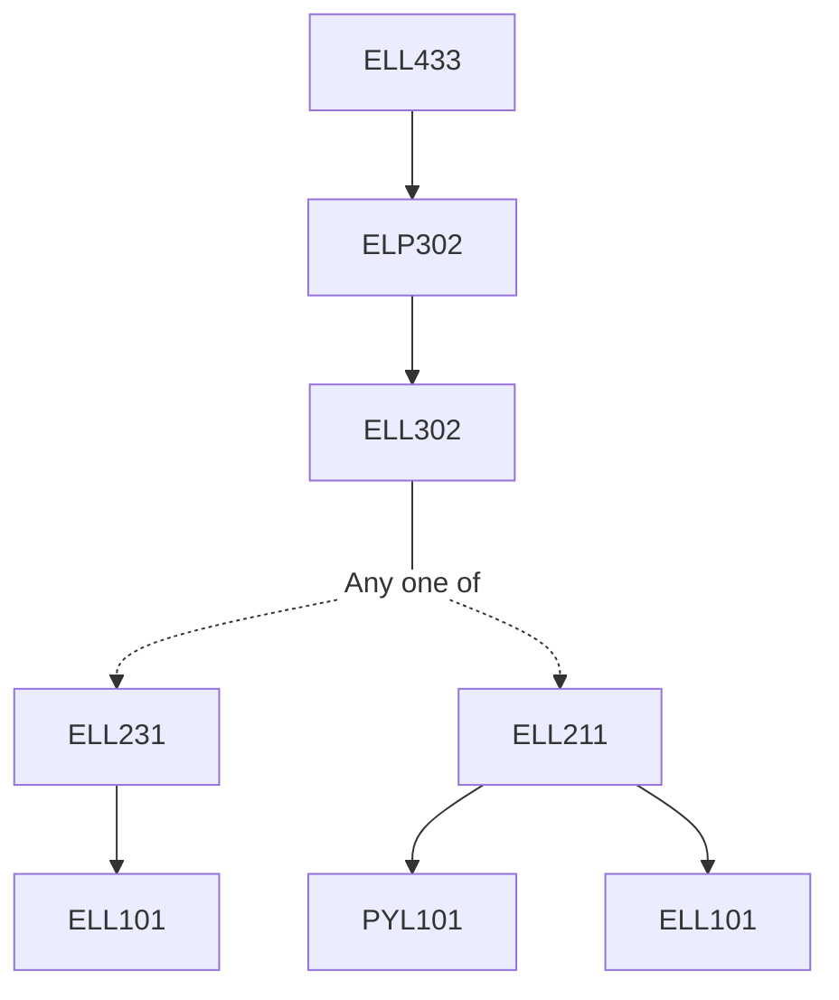

**Credits:** 4 (3-0-2)

**Prerequisites:** [[/Electrical Engineering/ELP302 | ELP302]]

#### Description 
Introduction to Power Electronic systems, Mathematical modeling of power electronic systems, State-space modeling, Average model, Circuit averaging model, Canonical circuit model, small-signal models and circuit transfer functions. Introduction to power electronics simulators, system oriented simulators, circuit simulators, merits and limitations. Introduction to magnetic design, high frequency inductor and transformer design. Hands-on exercise problems on power electronic circuits simulation using PSPICE/ SIMULINK/ PSIM simulators.

### Prerequisite Tree

