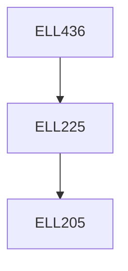

**Credits:** 3 (3-0-0)

**Prerequisites:** [[/Electrical Engineering/ELL225|ELL225]]

#### Description
No description available.

### Prerequisite Tree

```mermaid
flowchart TD
ELL436-340[ELL436]
ELL436-340 --> ELL225-340[ELL225]
ELL225-340 --> ELL205-340[ELL205]

classDef empty height:17px, fill:transparent, stroke:transparent;
classDef trueEmpty height:0px, width:0px;
```