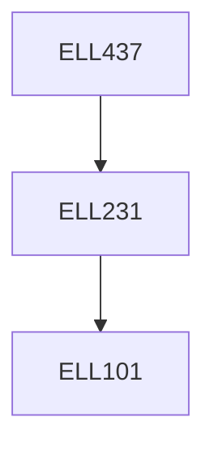

**Credits:** 3 (3-0-0)

**Prerequisites:** [[/Electrical Engineering/ELL231 | ELL231]]

#### Description 
To give an introduction about the power switching devices such as thyristors, GTO, MOSFETS, BJT, IGBT and MCTS. Basic concept of gate drivers (Trigger techniques, optical isolators, protection circuits, and isolation transformers), snubber design and protection schemes of power devices are to be discussed. Basic circuit configurations, design and analysis of choppers (step-up, step-down, step-up/down and multi-phase choppers), DC-DC converters (non-isolated and isolated), inverters (voltage and current source configurations) are discussed. This is followed by improved power quality converters (non-isolated and isolated) for reduction of harmonics at AC mains.

### Prerequisite Tree

