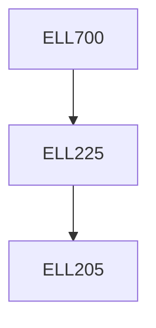

**Credits:** 3 (3-0-0)

**Prerequisites:** [[/Electrical Engineering/ELL225|ELL225]] or equivalent

#### Description
Review of matrix algebra, state variable modelling of continuous and discrete time systems, linearization of state equations, solution of state equations of linear time-invariant and time varying systems, Controllability and observability of dynamical systems, Minimal realization of linear systems and canonical forms, Liapunov’s stability theory for linear dynamical systems, State Feedback controllers, Observer and Controller design.

### Prerequisite Tree

