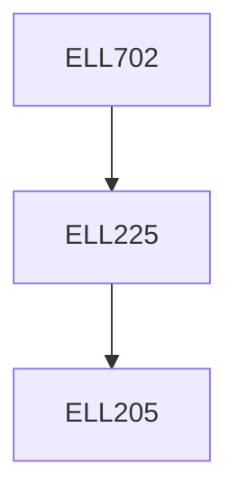

**Credits:** 3 (3-0-0)

**Prerequisites:** [[/Electrical Engineering/ELL225|ELL225]] or equivalent

#### Description
Introduction to nonlinear systems: Examples of phenomena, models & derivation of system equations. Fundamental properties: Existence & uniqueness, Dependence on initial conditions & parameters. Phase plane analysis. Limit cycles & oscillations. Describing function method and applications. Circle criterion. Lyapunov stability of autonomous systems. Perturbation theory & Averaging. Singular perturbation model and stability analysis. Basic results on Lie algebra. Controllability and Observability of nonlinear systems. Bifurcations. Chaos. Synchronization.

### Prerequisite Tree

