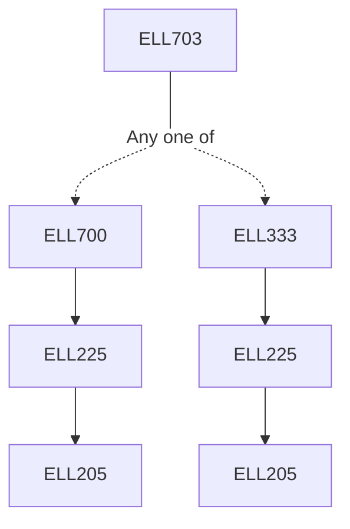

**Credits:** 3 (3-0-0)

**Prerequisites:** [[/Electrical Engineering/ELL700 | ELL700]] or [[/Electrical Engineering/ELL333 | ELL333]]

#### Description 
Maximization of functionals of a single and several functions using calculus of variations, Constrained extremals, Euler-Lagrange Equation, Necessary conditions for optimal control, Pontryagin’s minimum principle and state inequality constraints, Minimum time problems, Minimum control effort problems, Linear quadratic regulator problems, Riccati Equation, Singular intervals in optimal control problems, The principle of optimality, Application of the principle of optimality to decision making, Dynamic programming applied to routing problems, Solving optimal control problems using dynamic programming, Discrete linear regulator problem, Hamilton -Jacobi -Bellman Equation, Numerical Techniques to determine optimal trajectories.

### Prerequisite Tree

