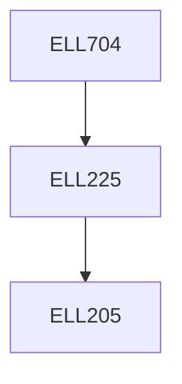

**Credits:** 3 (3-0-0)

**Prerequisites:** [[/Electrical Engineering/ELL225|ELL225]]

#### Description
Review of Coordinate Transformations, D-H parameters and kinematics. Velocity kinematics and Jacobian, Singularity analysis, Robot Dynamics. Motion planning, Robot control: linear methods – feedforward control, state feedback, observers; Nonlinear Control methods – Computed Torque Control, Feedback linearization, Sliding Mode control; Vision based Robotic Control. Holonomic and Non-Holonomic Systems, Mobile Robots : Modeling and Control, Odometry Analysis, Navigation problems with obstacle avoidance, motion capturing systems.

### Prerequisite Tree

