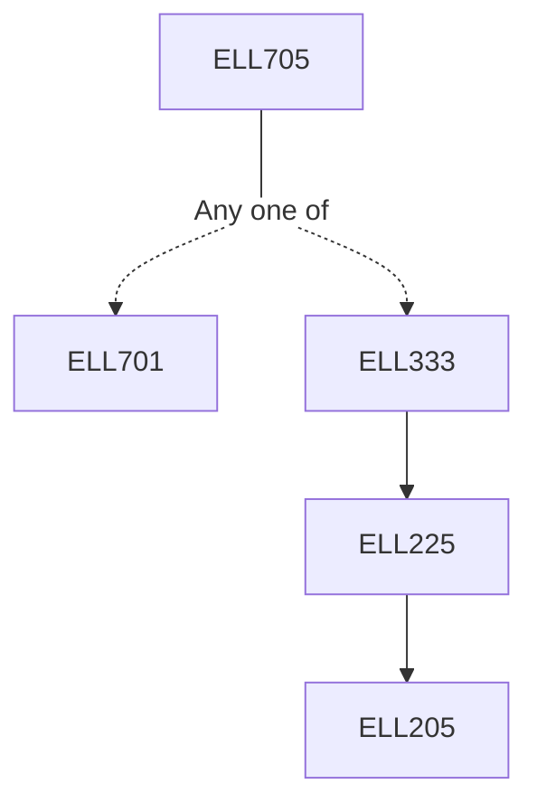

**Credits:** 3 (3-0-0)

**Prerequisites:** [[/Electrical Engineering/ELL701|ELL701]] or [[/Electrical Engineering/ELL333|ELL333]]

#### Description
MMSE estimation including LMS, Gaussian case. Wiener filtering & prediction. Kalman filtering & prediction. Extended Kalman filtering. Predictors for difference equation based models including ARMA, Box Jenkins & others. Statistical properties of Least Squares estimation and its relationship with Bayes estimation (ML, MAP), convergence analysis, CR bound. Recursive Least Squares, Iterative methods for nonlinear Least Squares. Identification problem: Different approaches for linear dynamical systems. Offline identification methods including Least Squares, Prediction error framework, Pseudo-linear regression (PLR) & Instrument variable methods. Recursive Identification of linear dynamical system: RLS, PLR, Prediction error framework & its application to ARMA & Innovations representation. Convergence Analysis of Recursive Identification methods: Associated ODE, Martingale. Nonlinear system identification. Subspace based method of system identification. Applications including LQG and adaptive control.

### Prerequisite Tree

