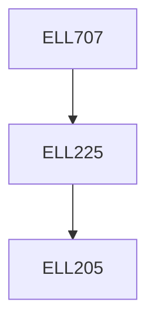

**Credits:** 3 (3-0-0)

**Prerequisites:** [[/Electrical Engineering/ELL225|ELL225]]

#### Description
MODELS: Variables and parameters, Law of mass action, Representations : Deterministic vs stochastic, Spatial aspects, Examples of core processes: Gene expression, Protein degradation, Phosphorylation.

DYNAMICS: Equilibrium solutions, Bifurcations, Switches, Bistability, Pulses and Oscillations, Circadian Rhythms and Clocks, Spatial patterns. Morphogenesis and Development.

CONTROL MECHANISMS: Performance Goals, Integral Feedback Control, Homeostasis and Perfect Adaptation, Bacterial Chemotaxis, Feedforward Loops, Fold Change Detection, Robustness to Perturbations, Tradeoffs, Internal Model Principle.

### Prerequisite Tree

