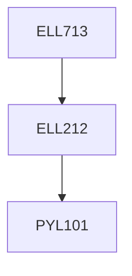

**Credits:** 3 (3-0-0)

**Prerequisites:** [[/Electrical Engineering/ELL212 | ELL212]]

**Overlaps with:** CRL711

#### Description 
Review of EM theory: Maxwell’s equations, plane waves in dielectric and conducting media, energy and power. Transmission lines and waveguides: closed and dielectric guides, planar transmission lines and optical fibre. Network analysis: scattering matrix other parameters, signal flow graphs and network representation. Impedance matching and tuning. Analysis of planar transmission lines. Analysis of design of passive components.

### Prerequisite Tree

