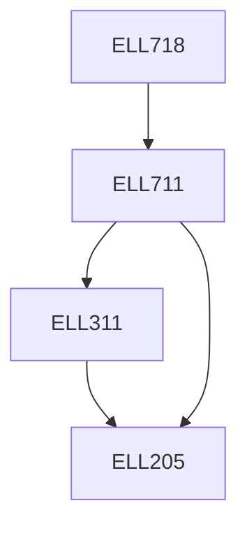

**Credits:** 3 (3-0-0)

**Prerequisites:** [[/Electrical Engineering/ELL711|ELL711]]

#### Description
Review of random variables, GS orthogonalization, geometric concepts, notions of projection, random processes, WSS processes, properties of autocorrelation and power spectral densities, properties of autocorrelation matrices, Cholesky decomposition, eigen-analysis, optimum Linear filtering, LMS and its performance, variants, Least- squares, QR decomposition and SVD, RLS and its performance, square-root RLS, Kalman Filters, spectrum modelling.

### Prerequisite Tree

