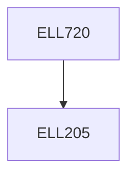

**Credits:** 3 (3-0-0)

**Prerequisites:** [[/Electrical Engineering/ELL205|ELL205]]

**Overlaps with:** ELL319

#### Description
Review of Signals and Systems, Sampling and data reconstruction processes.

Z transforms.

Discrete linear systems.

Frequency domain design of digital filters. Quantization effects in digital filters.

Discrete Fourier transform and FFT algorithms.

High speed convolution and its application to digital filtering.

Introduction to Multirate signal processing, Multirate filtering and Filterbanks: including Polyphase decomposition and perfect reconstruction, Cyclostationarity and LPTV filters, Introduction to Wavelet Transform.

The self-study component will consist of design problems in the above to be implemented on MATLAB.

### Prerequisite Tree

