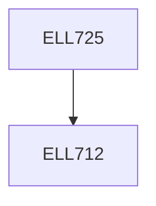

**Credits:** 3 (3-0-0)

**Prerequisites:** [[/Electrical Engineering/ELL712|ELL712]]

#### Description
The wireless channel (physical modeling, linear time-varying system, discrete-time baseband model, time and frequency coherence), point- to-point communication (detection, diversity, spatial multiplexing), cellular systems (multiple access and interference management), capacity of point-to-point wireless channels (single and multi- antenna), capacity of single-antenna multiuser channels, point- to-point multi-antenna (MIMO) channels and spatial multiplexing, point-to-point MIMO capacity and multiplexing architectures.

### Prerequisite Tree

