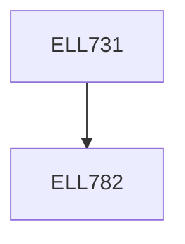

**Credits:** 3 (3-0-0)

**Prerequisites:** [[/Electrical Engineering/ELL782|ELL782]]

#### Description
Switched capacitor circuit principles and applications in filter design;

issues of clock feed through, charge injection and other non-idealities; design of switches; data converters: characteristics, static and dynamic; types of ADCs; track and hold, and sample and hold circuits; comparators; flash ADCs; pipelined ADCs; successive approximation register type ADCs; discrete-time and continuous time delta-sigma ADCs; higher order delta-sigma design; MASH structure; multi-bit delta-sigmas; decimation filtering – sinc and comb filters; digital to analog conversion; voltage-based DACs; charge-based DACs; current- based DACs – binary and thermometer currents; linearizing techniques for DACs; delta-sigma DACs; interpolation filtering; phase-locked loop basics; PLL dynamics; frequency synthesis; all-digital PLLs.

### Prerequisite Tree

