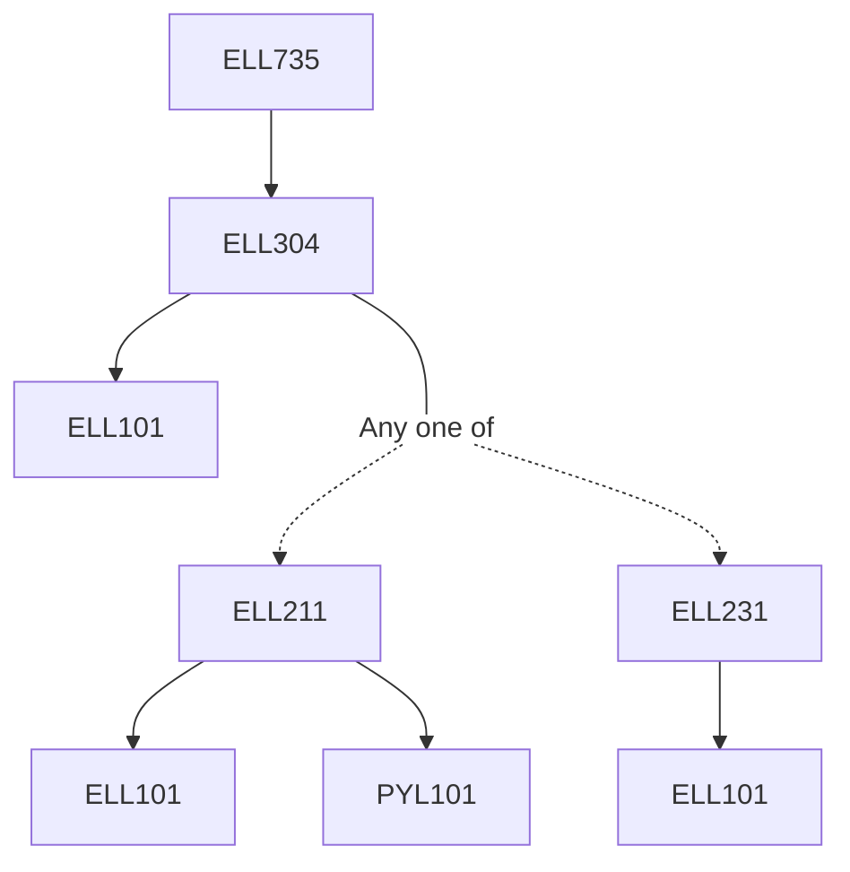

**Credits:** 3 (3-0-0)

**Prerequisites:** [[/Electrical Engineering/ELL304 | ELL304]]

#### Description 
Introduction to MOSFETs, Single stage amplifiers, Biasing circuits, Voltage and Current reference circuits, Feedback analysis, Multistage amplifiers, Mismatch and noise analysis, Differential amplifiers, High speed and low noise amplifiers, Output stage amplifiers, Oscillators.

### Prerequisite Tree

