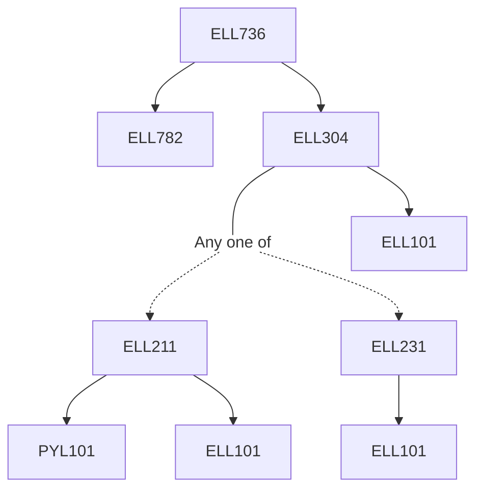

**Credits:** 3 (3-0-0)

**Prerequisites:** [[/Electrical Engineering/ELL304 | ELL304]], [[/Electrical Engineering/ELL782 | ELL782]]

#### Description 
Radiometry and Photometry (Light radiation, photometry, light source, light units), Introduction to properties of silicon and photon absorption, Imager formats, Basics of image sensors (fundamental definition of image sensors, pixels, photo-conversion principles, Charge coupled devices (operational principles, types and performance metrics), CMOS image sensors (operational principles, types and performance metrics), Noise, quantum efficiency, dynamic range and modulation transfer function analysis in image sensors, High speed image sensors, Back side illumination, Electron multiplication CCDs and CMOS, Colour detection in silicon, 3D imaging, machine vision cameras, polarization detection and scientific applications.

### Prerequisite Tree

