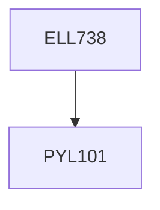

**Credits:** 3 (3-0-0)

**Prerequisites:** [[/Physics/PYL101|PYL101]]

**Overlaps with:** PYL795

#### Description
Ray Optics; Wave Optics: Plane Waves, Spherical Waves, Interference, Diffraction; Paraxial Waves; Beam Optics; Fabry Perot Cavity; Microresonators - Ring Resonators, Disc Resonators; Review of Electromagnetic (EM) Theory; Boundary Conditions; and some relevant EM problems; FDTD and FEM modeling; Fundamentals of Plasmonics - Surface Plasmon Resonance, Dispersion relation, Plasmon coupling conditions, Plasmonic gratings, Models describing the refractive index of metals; Localized Surface Plasmon Resonance; Plasmonic Sensors and Devices; Surface-enhanced Raman Scattering; Plasmonic waveguides and Interconnects; Photonic Crystals and Devices.

### Prerequisite Tree

