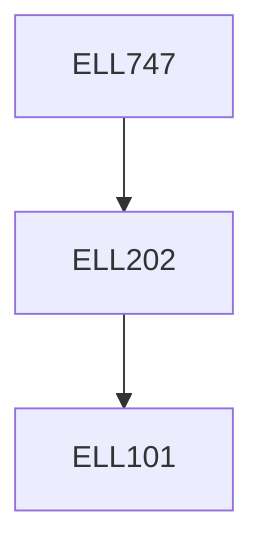

**Credits:** 3 (3-0-0)

**Prerequisites:** [[/Electrical Engineering/ELL202|ELL202]] or circuit theory

#### Description
Review of network theorems such as reciprocity, Tellegen’s theorem, scattering parameters, properties of lossless passive networks; Butterworth approximation; Chebyshev approximation; synthesis of Butterworth and Chebyshev filters; odd versus even order filters; sensitivity of lossless LC ladder filters; frequency transformations; inverse Chebyshev and elliptic approximations; synthesis of inverse Chebyshev and elliptic filters; review of properties of p.r. functions; Darlington synthesis; signal flow graphs of ladder filters; opamp-RC implementation; Gm-C implementation; switched- capacitor implementation; minimum required performance of active components; tuning of filters; transmission line based filters: using high-Z low-Z technique, using Kuroda’s identities; bi-quad based design approaches and drawbacks; Tow-Thomas biquad, Sallen-Key biquad.

### Prerequisite Tree

