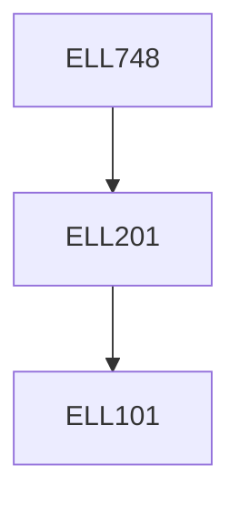

**Credits:** 3 (3-0-0)

**Prerequisites:** [[/Electrical Engineering/ELL201|ELL201]]

#### Description
Overview and definition of power quality (PQ), Sources of pollution, International power quality standards, and regulations. Power quality monitoring. Power quality problems. Loads which causes power quality problems.

Power factor correction, zero voltage regulation, reactive power compensation, load balancing using load compensation techniques: passive shunt and series compensation, DSTATCOM (Distribution Static Compensators), DVR (Dynamic Voltage Restorers), UPQC (Universal Power Quality Conditioners).

Harmonic effects-within the power system, interference with communication Harmonic measurements. Harmonic elimination-using active (shunt, series and hybrid) and passive (shunt and series) filters. Improved power quality converters: single ac-dc converters, bridgeless isolated converter, bridgeless non-isolated converters, multi-pulse converters, multilevel converters, line commutated converters, power quality improvement in SMPS, UPS, drives, welding systems, lighting systems, and renewable energy systems.

### Prerequisite Tree

