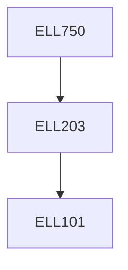

**Credits:** 3 (3-0-0)

**Prerequisites:** [[/Electrical Engineering/ELL203|ELL203]]

#### Description
Review of dynamic Modeling of systems, Basic concepts of electromechanical energy conversion, Modeling of Transformer, Generalized Theory of Electrical machines, Modeling of DC Machine, Induction Machine, Wound Field Synchronous machine, and special machines such as BLDC, PMSM etc.

### Prerequisite Tree

