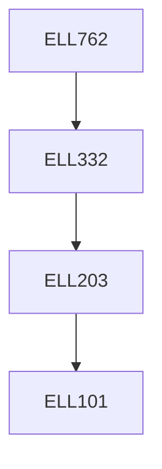

**Credits:** 3 (3-0-0)

**Prerequisites:** [[/Electrical Engineering/ELL332|ELL332]]

#### Description
Fundamental concepts in control of electric drive systems. Intelligent Control algorithms used for electric drive systems. Application of Fuzzy Logic, Neural Networks, Genetic Algorithm, Hybrid Fuzzy and Nonlinear Control of Power Converters and Drives. Other recent topics on Intelligent Control of Drives.

### Prerequisite Tree

