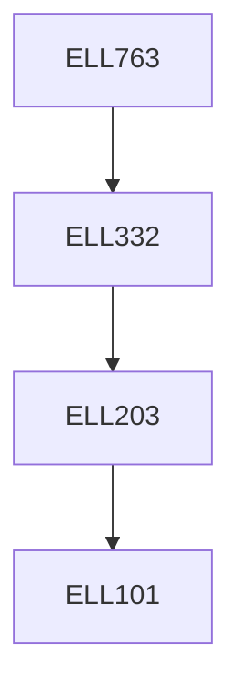

**Credits:** 3 (3-0-0)

**Prerequisites:** [[/Electrical Engineering/ELL332|ELL332]]

#### Description
Types of Controllers: Proportional-Integral Control, Hysteresis Control etc, Advanced DC Drives: Cascaded Control Loop Structure, Control Loop Design etc, Control of BLDC drive: Modeling and Control of BLDC Drive, Review of Power Converter and Modulation Techniques: Modeling of Power Converters, Sinusoidal Pulse-Width Modulation, Space Vector Pulse-Width Modulation, Field Oriented Control (FOC) of AC Machines: Generalized Space-Phasor Model of AC Machines in different Flux Frames of References, Control Principle, FOC of Permanent Magnet Synchronous Machine (PMSM), FOC of Squirrel Cage Induction Machine (SQIM), Direct Torque Control (DTC) of AC Machines: Control Principle, DTC of Squirrel Cage Induction Machine (SQIM).

### Prerequisite Tree

