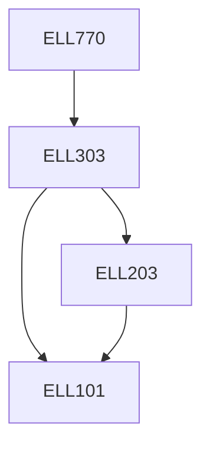

**Credits:** 3 (3-0-0)

**Prerequisites:** [[/Electrical Engineering/ELL303|ELL303]]

#### Description
Revision of Basic Concepts in pu and modeling, Admittance model of transmission network, Power Flow solutions (GS, NR, DLF, FDLF, DCLF), Symmetrical components and sequence networks, Faults - Symmetrical and unsymmetrical, Z Bus building algorithms, State Estimation, Voltage Stability, Continuation Power Flow, Power System Security (Overload, Voltage), Introduction to WAMS and PMUs, Linear State Estimation.

### Prerequisite Tree

