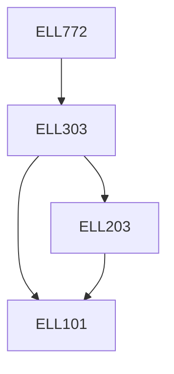

**Credits:** 3 (3-0-0)

**Prerequisites:** [[/Electrical Engineering/ELL303|ELL303]]

#### Description
Smart grids key characteristics, demand side management, load characteristics, hybrid electric vehicles, energy markets, deregulation, wide area monitoring, protection and control, smart metering, adaptive relaying, power line carrier communication and networking, architectures and standards, renewable energy, distributed generation, smart grids policies.

### Prerequisite Tree

