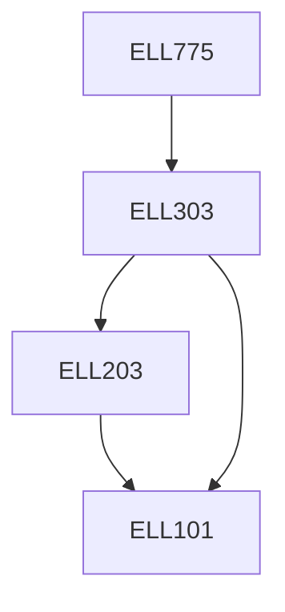

**Credits:** 3 (3-0-0)

**Prerequisites:** [[/Electrical Engineering/ELL303|ELL303]]

#### Description
Dynamic models of synchronous machines, excitation system, turbines, governors, loads. Modelling of single-machine-infinite bus system. Mathematical modelling of multimachine system. Dynamic and transient stability analysis of single machine and multi-machine systems. Power system stabilizer design for multimachine systems. Dynamic equivalencing. Voltage stability Techniques for the improvement of stability. Direct method of transient stability analysis: Transient energy function approach.

### Prerequisite Tree

