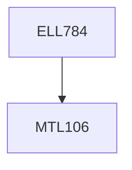

**Credits:** 3 (3-0-0)

**Prerequisites:** [[/Mathematics/MTL106|MTL106]]

**Overlaps with:** ELL409, COL341, COL774

#### Description
Introduction to Machine intelligence and learning; linear learning models; Artificial Neural Networks: Single Layer Networks, LTUs, Capacity of a Single Layer LTU, Nonlinear Dichotomies, Multilayer Networks, Growth networks, Backpropagation and some variants; Support Vector Machines: Origin, Formulation of the L1 norm SVM, Solution methods (SMO, etc.), L2 norm SVM, Regression, Variants of the SVM; Complexity: Origin, Notion of the VC dimension, Derivation for an LTU, PAC learning, bounds, VC dimension for SVMS, Learning low complexity machines - Structural Risk Minimisation; Unsupervised learning: PCA, KPCA; Clustering: Origin, Exposition with some selected methods; Feature Selection: Origin, Filter and Wrapper methods, State of the art - FCBF, Relief, etc; Semi-supervised learning: introduction; Assignments/Short project on these topics.

### Prerequisite Tree

