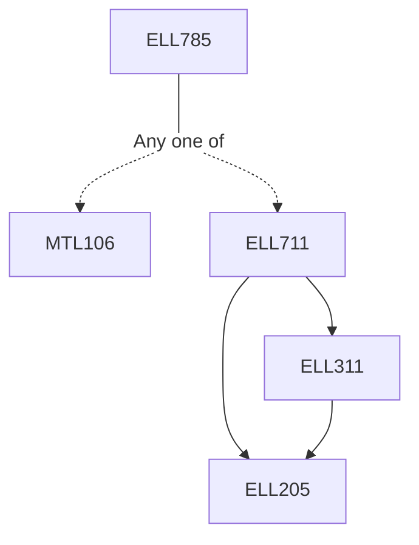

**Credits:** 3 (3-0-0)

**Prerequisites:** [[/Mathematics/MTL106|MTL106]]/[[/Electrical Engineering/ELL711|ELL711]]

**Overlaps with:** CSL374, CSL672 (20%)

#### Description
Theory/Lecture: Review of data communication techniques, basic networking concepts, layered network and protocol concepts, quality of service, motivations for cross-layer protocol design. Motivations for performance analysis, forward error correction and re-transmission performances, Markov and semi-Markov processes, Little’s theorem, M/M/m/k, M/G/1 systems, priority queueing, network of queues, network traffic behavior. Concepts and analysis of multi-access protocols; contention-free and contention multi-access protocols. Basic graph theoretic concepts, routing algorithms and analysis.

Suggested lab Course content:

Laboratory: Simulation and hardware experiments on different aspects of computer communication networks. Network traffic generation and analysis, differentiated service queues, network of queues using discrete event simulations.

### Prerequisite Tree

