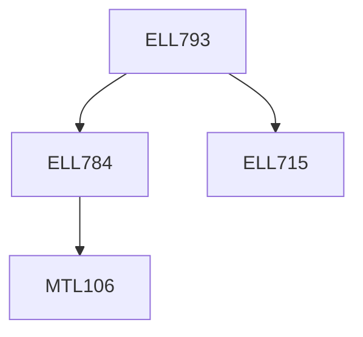

**Credits:** 3 (3-0-0)

**Prerequisites:** [[/Electrical Engineering/ELL715|ELL715]],[[/Electrical Engineering/ELL784|ELL784]]

**Overlaps with:** COL780

#### Description
Link between Computer Vision, Computer Graphics, Image Processing and related fields; feature extraction; camera models; multi-view geometry; applications of Computer Vision in day-to-day life.

### Prerequisite Tree

