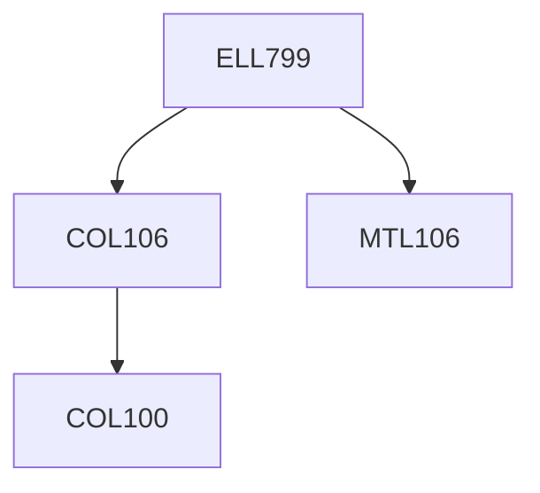

**Credits:** 3 (3-0-0)

**Prerequisites:** [[/Computer Science and Engineering/COL106|COL106]], [[/Mathematics/MTL106|MTL106]]

#### Description
Introduction to natural computing uncertainty handling: probability and fuzzy logic; evolutionary computing and problem solving as search; swarm intelligence ant colonies, swarm robotics; immunocomputing; introduction to DNA computing; basics of quantum computing.

### Prerequisite Tree

