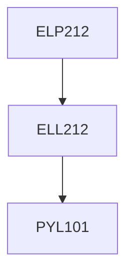

**Credits:** 1.5 (0-0-3)

**Prerequisites:** [[/Electrical Engineering/ELL212|ELL212]]

#### Description
No description available.

### Prerequisite Tree

```mermaid
flowchart TD
ELP212-378[ELP212]
ELP212-378 --> ELL212-378[ELL212]
ELL212-378 --> PYL101-378[PYL101]

classDef empty height:17px, fill:transparent, stroke:transparent;
classDef trueEmpty height:0px, width:0px;
```