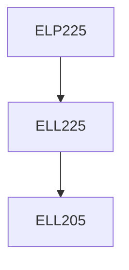

**Credits:** 1.5 (0-0-3)

**Prerequisites:** [[/Electrical Engineering/ELL225|ELL225]]

#### Description
Basics of Sensors and Actuators, Study of AC and DC Motors, Linear Systems, Analog and Digital Motors, Synchros, Temperature Control.

### Prerequisite Tree

